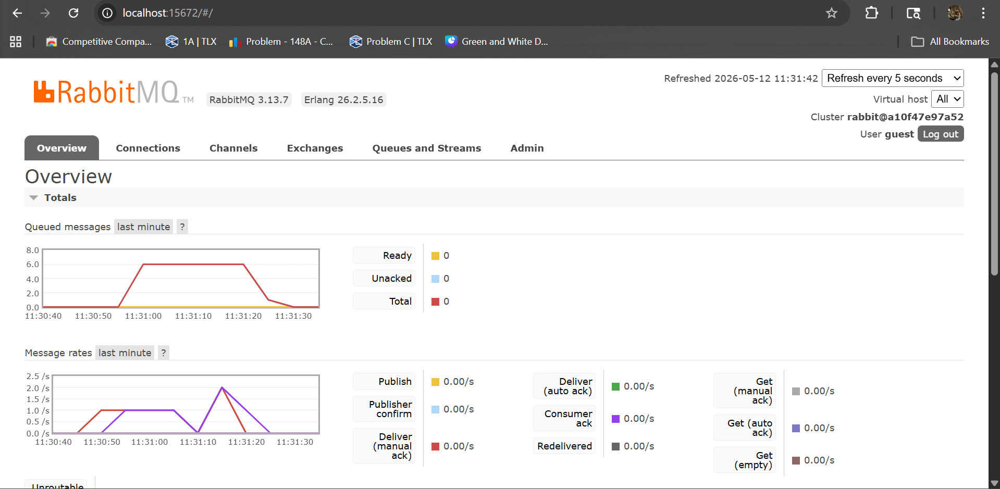

1. What is amqp?  
    AMQP adalah singkatan dari Advanced Message Queuing Protocol. AMQP adalah protokol komunikasi yang digunakan untuk mengirim dan menerima pesan melalui message broker seperti RabbitMQ.

    Dalam project subscriber, AMQP digunakan oleh crosstown_bus untuk menghubungkan program subscriber ke RabbitMQ. Jadi, ketika ada publisher yang mengirim event user_created, subscriber ini akan menerima pesan `user_crated` lalu menjalankan handler UserCreatedHandler. 

2. What does it mean? guest:guest@localhost:5672 , what is the first guest, and what is the second guest, and what is localhost:5672 is for?  
    - guest pertama adalah username untuk login ke RabbitMQ.  
    - guest kedua adalah password untuk username tersebut.  
    - localhost berarti RabbitMQ berjalan di komputer yang sama dengan program subscriber.  
    - 5672 adalah port default AMQP yang digunakan RabbitMQ untuk menerima koneksi dari aplikasi.  

    Jadi, kode tersebut berarti: program subscriber mencoba terhubung ke RabbitMQ di komputer lokal melalui port 5672, menggunakan username guest dan password guest. Setelah berhasil terhubung, subscriber akan mendengarkan queue/event user_created.

### **Simulating slow subscriber**

Graf pada RabbitMQ menunjukkan angka 6 karena pada rentang waktu tersebut pernah ada 6 pesan yang masuk/menunggu di queue.
Pada program publisher, setiap kali dijalankan, program mengirim 5 pesan ke message broker. Jika grafik menunjukkan angka 6, kemungkinan ada 1 pesan lama yang masih tersisa di queue dari eksekusi sebelumnya, lalu ditambah 5 pesan baru dari publisher.

