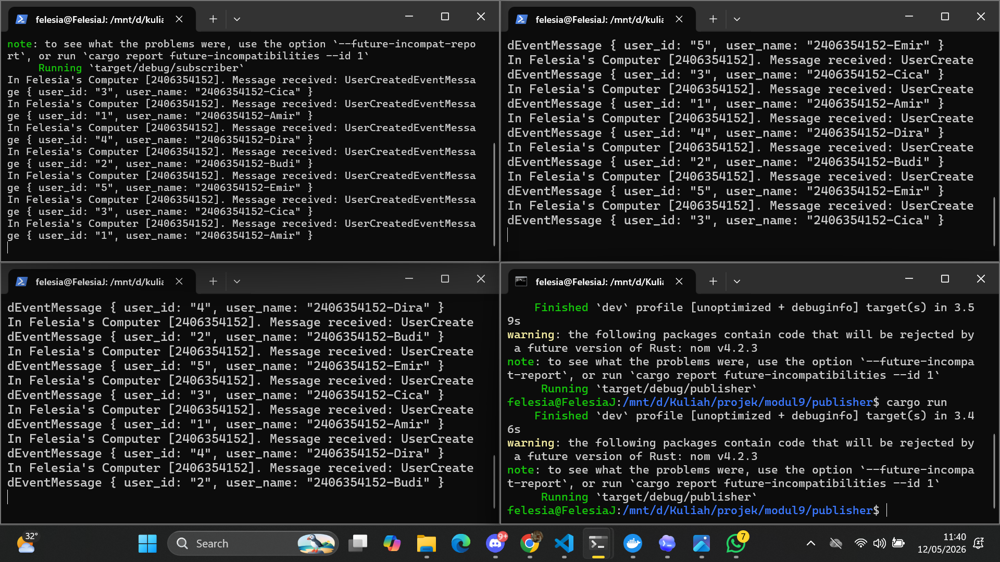
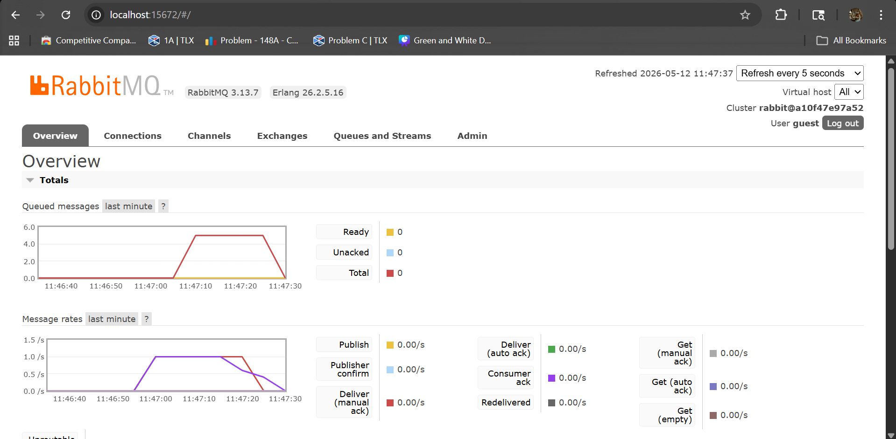

1. What is amqp?  
    AMQP adalah singkatan dari Advanced Message Queuing Protocol. AMQP adalah protokol komunikasi yang digunakan untuk mengirim dan menerima pesan melalui message broker seperti RabbitMQ.

    Dalam project subscriber, AMQP digunakan oleh crosstown_bus untuk menghubungkan program subscriber ke RabbitMQ. Jadi, ketika ada publisher yang mengirim event user_created, subscriber ini akan menerima pesan `user_created` lalu menjalankan handler UserCreatedHandler. 

2. What does it mean? guest:guest@localhost:5672 , what is the first guest, and what is the second guest, and what is localhost:5672 is for?  
    - guest pertama adalah username untuk login ke RabbitMQ.  
    - guest kedua adalah password untuk username tersebut.  
    - localhost berarti RabbitMQ berjalan di komputer yang sama dengan program subscriber.  
    - 5672 adalah port default AMQP yang digunakan RabbitMQ untuk menerima koneksi dari aplikasi.  

    Jadi, kode tersebut berarti: program subscriber mencoba terhubung ke RabbitMQ di komputer lokal melalui port 5672, menggunakan username guest dan password guest. Setelah berhasil terhubung, subscriber akan mendengarkan queue/event user_created.

### **Simulating slow subscriber**

Graf pada RabbitMQ menunjukkan angka 6 karena pada rentang waktu tersebut pernah ada 6 pesan yang masuk/menunggu di queue.
Pada program publisher, setiap kali dijalankan, program mengirim 5 pesan ke message broker. Jika grafik menunjukkan angka 6, kemungkinan ada 1 pesan lama yang masih tersisa di queue dari eksekusi sebelumnya, lalu ditambah 5 pesan baru dari publisher.

### **Reflection and Running at least three subscribers**

Setelah menjalankan minimal tiga subscriber secara bersamaan, spike pada message queue terlihat turun lebih cepat dibandingkan ketika hanya ada satu slow subscriber.

Pada gambar **Simulating slow subscriber**, grafik queued messages sempat naik sampai sekitar 6 pesan dan bertahan cukup lama sebelum turun. Hal ini terjadi karena subscriber hanya memproses satu pesan dalam satu waktu, sementara di kode `subscriber/src/main.rs` setiap message sengaja diberi delay `thread::sleep(Duration::from_millis(1000))`. Akibatnya, ketika publisher mengirim beberapa message sekaligus, RabbitMQ harus menunggu subscriber menyelesaikan message satu per satu. Queue menjadi menumpuk sementara, lalu baru turun perlahan.

Pada gambar **Running at least three subscribers**, spike queue lebih cepat turun ke 0. Walaupun setiap subscriber tetap membutuhkan sekitar 1 detik untuk memproses satu message, sekarang ada beberapa consumer yang aktif pada queue yang sama. RabbitMQ dapat mendistribusikan message ke beberapa subscriber, sehingga proses konsumsi berjalan paralel. Dengan 3 subscriber, beberapa message bisa diproses pada waktu yang sama, bukan menunggu satu subscriber menyelesaikan semuanya sendiri.

Dari sisi kode, improvement yang terlihat adalah menjalankan lebih banyak subscriber untuk meningkatkan throughput consumer. Publisher tetap mengirim 5 message per run, tetapi kapasitas pemrosesan di sisi subscriber meningkat karena ada lebih banyak worker yang mengambil message dari RabbitMQ. Ini menjelaskan mengapa spike pada grafik kedua lebih cepat berkurang dibandingkan grafik pertama.

Beberapa hal yang juga bisa diperbaiki pada kode:
- Pada publisher, handler tidak diperlukan karena publisher hanya bertugas mengirim event, bukan menerima event.
- Pada subscriber, nama variabel delay sebaiknya dibuat jelas, misalnya `processing_delay`, karena nilainya 1000 ms atau 1 detik.
- Hasil dari `publish_event` dan `listen` sebaiknya tidak diabaikan, supaya error koneksi atau publish bisa terlihat saat program dijalankan.
- Loop kosong di subscriber sebaiknya diganti dengan mekanisme idle seperti `thread::park()` agar program tetap hidup tanpa membuang CPU.
